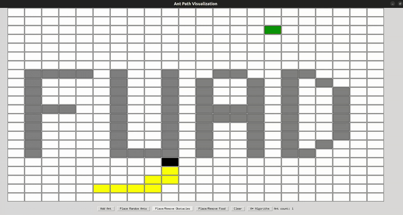

# 🐜 A* Ant Simulation

A Tkinter-based grid simulation where an ant searches for food using the A* pathfinding algorithm. Supports placing ants, obstacles, and food with interactive controls and visual step-by-step animation.

## Features

- **A* Pathfinding:** Watch an ant intelligently find its way to food using the A* algorithm.
- **Interactive Grid:** Place ants, obstacles, and food anywhere on the grid.
- **Step-by-Step Animation:** Visualize each step of the ant's journey as it solves the path.
- **Tkinter GUI:** Simple graphical interface for interaction and control.
- **Customizable:** Adjust grid size, reset the simulation, and experiment with different scenarios.

## Installation

1. **Clone the repository:**
   ```bash
   git clone https://github.com/Fuadibrahiml1/a-star-ant-simulation.git
   cd a-star-ant-simulation
   ```

2. **Install requirements:**
   This project requires Python 3.x. Tkinter is included by default in most Python installations.

## Usage

Run the main Python file :

```bash
python     Astarproje.py
```

### Controls

- **Place Ant:** Click on a grid cell to position the ant.
- **Set Food:** Click on another cell to add food.
- **Add Obstacles:** Drag or click to place obstacles that block the ant's path.
- **Start Simulation:** Press the start button to watch the ant find its way to the food.
- **Step-by-Step:** Use the step button to move the ant one step at a time.
- **Reset Grid:** Clear the grid and try new scenarios.

## Demo



## How it Works

- The ant uses the A* algorithm to find the shortest path to the food, considering obstacles.
- The simulation visualizes each search step, showing pathfinding in action.


## License

This project is licensed under the MIT License.

## Author

[Fuad Ibrahimli](https://github.com/Fuadibrahiml1)
